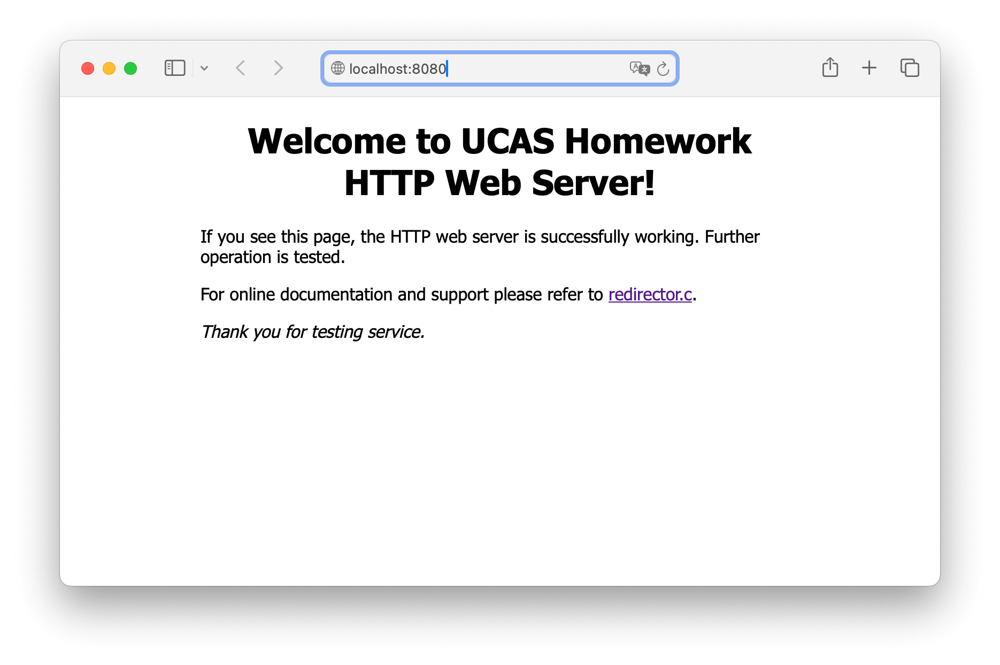
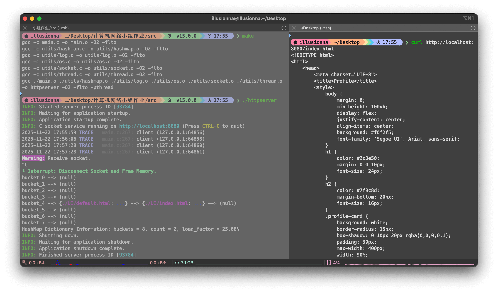

# 简易 HTTP 1.1 Web 服务器

## 作业题目

实验类型：系统实现

项目描述：基于 TCP Sockets，从零开始实现一个简单的 HTTP/1.1 Web 服务器，监听 8080 端口，能够解析 HTTP 请求并响应，对于接收的请求：
- 如果当前目录存在所请求的文件，返回状态码 200，以及所请求的文件
- 如果所请求的为部分内容（请求中有 Range 字段），返回状态码 206，以及相应的部分内容
- 如果当前目录没有所请求的文件，返回状态码 404

实验目的：理解 HTTP 协议的底层工作原理

涉及技术：HTTP 协议，Socket 编程

实验拓扑：h1 -- s1 -- h2，其中 s1 和 h2 通过 10.0.0.2 链接

实验流程：
- 在 h2 服务器的 xterm 中准备一个 index.html 文件，运行所实现的 HTTP 服务器程序，监听端口号 8080
- 在 h1 客户端的 xterm 中，使用 curl 向 h2 发起请求
    - curl http://10.0.0.2:8080/index.html
	- curl -r start-end http://10.0.0.2:8080/index.html -o part.html
	- curl http://10.0.0.2:8080/nonexistent.html
- 检查 h1 是否成功获取了相应的内容（完整文件、部分文件、404 代码）

## 测试用例

```
curl http://localhost:8080
curl http://localhost:8080/index.html
curl http://localhost:8080/nonexistent.html
curl http://localhost:8080/LICENSE/MIT
curl http://localhost:8080/LICENSE/../main.py
curl http://localhost:8080/LICENSE/../../log.csv

curl -r 7-12 http://localhost:8080/index.html
curl -r 7-12 http://localhost:8080/index.html -o part.html
curl -r 32-64 http://localhost:8080/LICENSE/GNU-GPL-3.0
```

## 效果图



