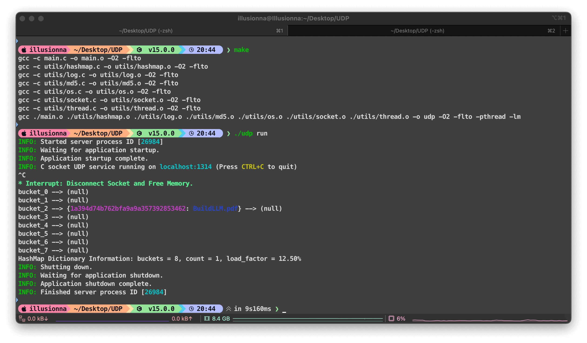
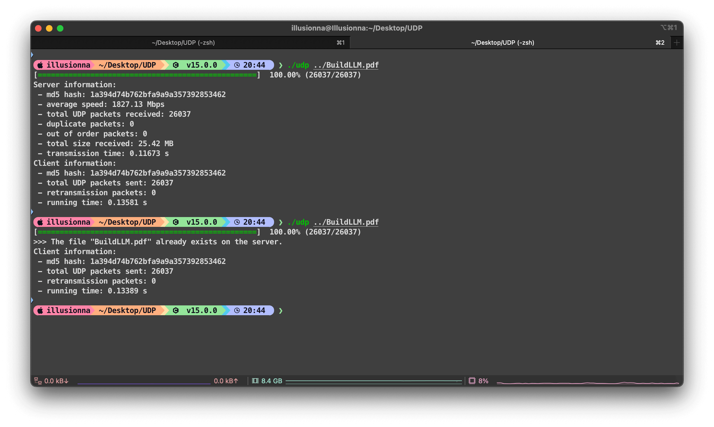
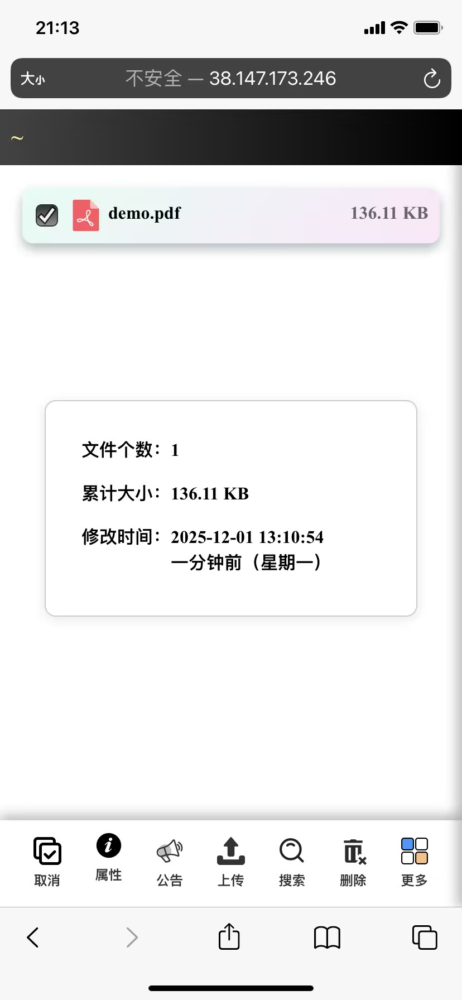

# 基于 UDP 的可靠数据传输

## 项目描述

在 UDP 之上实现一个你自己的简单可靠传输协议：
- 序列号 SEQ 来保证顺序
- 确认 ACK 来保证送达
- 超时重传机制
- 简单的流量控制（滑动窗口机制、接收窗口调整）

## 实验目的

掌握传输控制中可靠传输和流控机制

## 拓扑结构

```text
				    10Mbps
				   20ms 延迟
				    5% 丢包
h1 ----------- r1 ----------- h2
```

## 实验流程

- 在 h1 的 xterm 中，运行你实现的 RDT 程序的服务器模式，用于接收数据
- 在 h2 的 xterm 中，运行你实现的 RDT 程序的客户端模式，用于向服务器发送数据（譬如一个 10MB 左右大小的文件）
- 观察你的 RDT 协议是否能正确处理丢包，使用 md5sum 验证文件是否完整有序地送达
- 计算平均传输速率与可用带宽（10Mbps）有多大差距

## 公网测试

- 将 client 客户端的本地回环 `127.0.0.1` 修改成 `38.147.173.246` (服务器拉跨已经炸了, 可使用 `ipconfig / ifconfig` 局域网测试)
- 使用 `./udp.exe demo.pdf` 测试
- 浏览器打开 `http://38.147.173.246:1315`
- 登录密码 `1315`
- 文件服务器 [https://github.com/Illusionna/LocalTransfer](https://github.com/Illusionna/LocalTransfer)

## 效果图





<div style="text-align: center;">
	
</div>